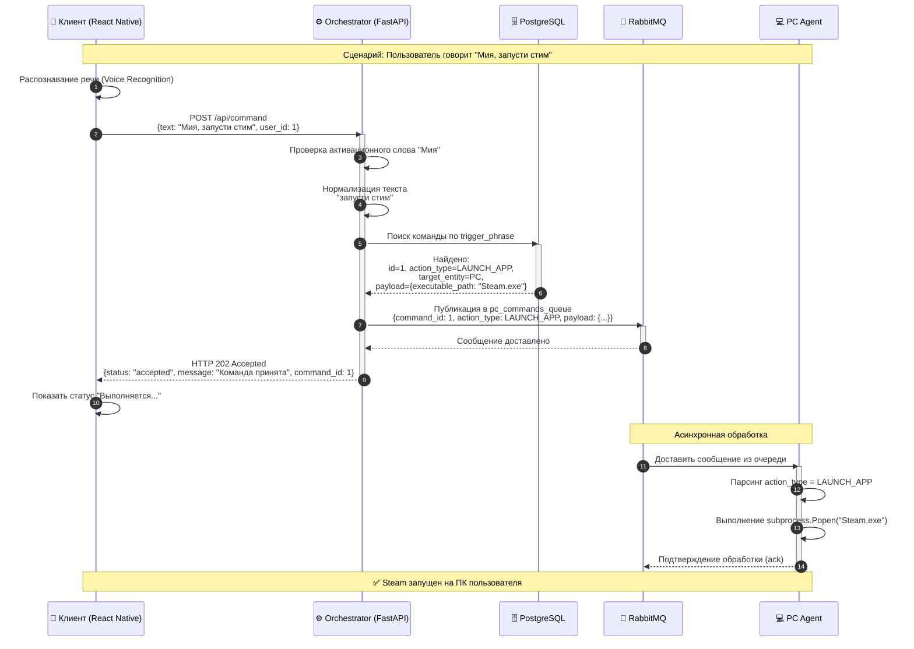
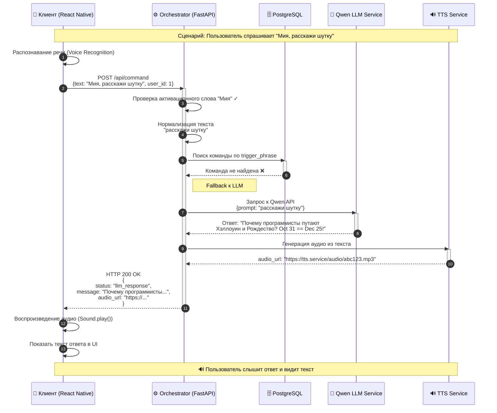
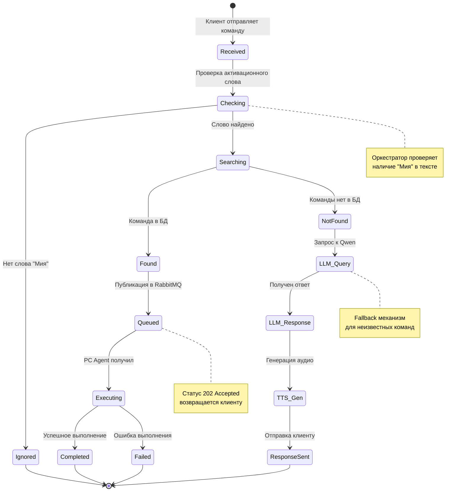

# Диаграмма последовательности взаимодействия компонентов
## Голосовой ассистент "Мия"

Этот документ содержит Mermaid диаграммы для двух сценариев работы системы.

---

## Сценарий A: Успешное выполнение известной команды ("Запусти Стим")



---

## Сценарий B: Fallback к ИИ для неизвестной команды



---

## Общая архитектура системы

```mermaid
graph TB
    subgraph Client_Layer["📱 Клиентский слой"]
        RN[React Native App]
        Voice[Voice Recognition]
        Audio[Audio Player]
    end
    
    subgraph API_Layer["⚙️ API Layer (Orchestrator)"]
        FastAPI[FastAPI Server]
        Auth[Auth Module]
        Router[Command Router]
        LLM_Fallback[LLM Fallback]
    end
    
    subgraph Data_Layer["💾 Data Layer"]
        PostgreSQL[(PostgreSQL)]
        RabbitMQ[(RabbitMQ)]
    end
    
    subgraph Agent_Layer["🤖 Agent Layer"]
        PC_Agent[PC Agent]
        Controller_Agent[Controller Agent<br/>(Future)]
    end
    
    subgraph External_Services["🌐 External Services"]
        Qwen[Qwen LLM API]
        TTS[TTS Service]
    end
    
    RN -->|Voice Input| Voice
    RN -->|HTTP POST| FastAPI
    FastAPI --> Router
    Router -->|Query| PostgreSQL
    Router -->|Publish| RabbitMQ
    Router -->|Fallback| LLM_Fallback
    LLM_Fallback -->|Request| Qwen
    LLM_Fallback -->|Generate| TTS
    RabbitMQ -->|Consume| PC_Agent
    RabbitMQ -->|Consume| Controller_Agent
    FastAPI -->|Response| RN
    RN -->|Play| Audio
    
    style Client_Layer fill:#e1f5ff
    style API_Layer fill:#fff4e1
    style Data_Layer fill:#e8f5e9
    style Agent_Layer fill:#fce4ec
    style External_Services fill:#f3e5f5
```

---

## Диаграмма состояний команды



---

## Пояснения к диаграммам

### Ключевые моменты:

1. **Асинхронность**: После публикации в RabbitMQ Orchestrator сразу возвращает ответ клиенту (202 Accepted), не дожидаясь выполнения команды агентом.

2. **Активационное слово**: Все команды игнорируются без слова "Мия" - это предотвращает ложные срабатывания.

3. **Fallback к LLM**: Если команда не найдена в базе, система использует Qwen для генерации ответа, что делает ассистента более гибким.

4. **Масштабируемость**: Архитектура позволяет добавлять новые типы агентов (Controller Agent для умного дома) без изменения ядра системы.

### Поток данных:

```
Голос → Текст → Orchestrator → [БД или LLM] → [RabbitMQ или TTS] → Клиент
```
